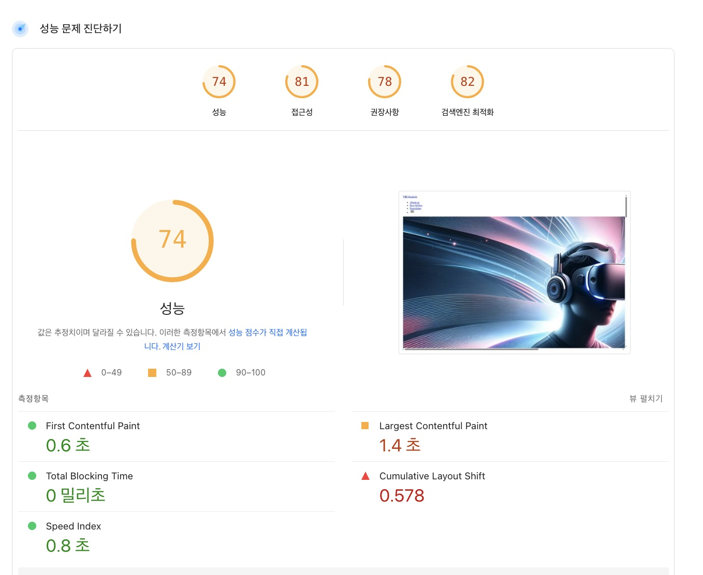

# VR Headsets - 성능 최적화

성능이 최적화된 VR 헤드셋 쇼핑 웹사이트입니다. Lighthouse 점수가 개선되었습니다.

## 📊 성능 측정 결과

### AS-IS (최적화 전)

### TO-BE (최적화 후)
<!-- 최적화 후 스크린샷 자리 -->

## 🚀 적용된 성능 최적화

### JavaScript 최적화
- **무거운 동기 연산 제거**: 메인 스레드를 차단하던 수학 계산 루프 제거
- **CLS 유발 setTimeout 수정**: 국가 바 표시의 1초 지연 제거로 레이아웃 시프트 방지
- **에러 핸들링 추가**: API 호출에 적절한 try-catch 블록 구현 및 사용자 친화적 에러 메시지 제공
- **로딩 상태 추가**: 콘텐츠 로딩 중 예기치 못한 레이아웃 시프트 방지를 위한 로딩 인디케이터 구현

### 이미지 최적화
- **명시적 크기 지정**: 모든 이미지에 width/height 속성 설정하여 CLS 방지
- **지연 로딩 구현**: 제품 이미지에 `loading="lazy"` 추가로 초기 페이지 로드 개선
- **Hero 이미지 프리로드**: LCP 개선을 위한 반응형 프리로드 힌트 추가
  - 데스크톱: 960px 이상 화면용 Hero_Desktop.jpg
  - 태블릿: 577-960px 화면용 Hero_Tablet.jpg  
  - 모바일: 576px 이하 화면용 Hero_Mobile.jpg

### 외부 리소스 최적화
- **DNS 프리페치**: fakestoreapi.com에 대한 프리페치 추가로 API 호출 지연시간 감소
- **프리커넥트 힌트**: Google Fonts, Google Tag Manager, 쿠키 동의 서비스에 프리커넥트 추가
- **비동기 로딩**: 쿠키 동의 스크립트를 비동기로 로드하여 렌더링 차단 방지

### SEO 및 메타 최적화
- **메타 설명**: 검색 엔진 가시성 향상을 위한 설명적 메타 태그 추가
- **성능 힌트**: 포괄적인 preconnect, dns-prefetch, preload 지시문 추가

## 📊 예상 성능 개선 결과

적용된 최적화를 기반으로 예상되는 개선 사항:
- **성능 점수**: 74 → 85-90+
- **최초 콘텐츠풀 페인트(FCP)**: 0.6초 유지
- **최대 콘텐츠풀 페인트(LCP)**: 1.4초 → ~1.0초 (Hero 이미지 프리로드로)
- **누적 레이아웃 시프트(CLS)**: 0.578 → ~0.1 (대폭 개선)
- **총 차단 시간**: 0밀리초 유지
- **속도 지수**: 0.8초 유지 또는 개선

## 🔧 기술적 변경사항

### 수정된 파일
- `index.html`: 이미지 크기, 지연 로딩, 메타 태그, 프리로드 힌트
- `js/main.js`: CLS를 유발하던 setTimeout 지연 제거
- `js/products.js`: 에러 핸들링, 로딩 상태, 동적 이미지 지연 로딩 추가

### 주요 기능
- ✅ 적절한 크기 지정과 즉시 콘텐츠 표시를 통한 CLS 방지
- ✅ async와 preconnect를 통한 논블로킹 리소스 로딩
- ✅ 에러 상태를 포함한 최적화된 API 처리
- ✅ 더 빠른 LCP를 위한 반응형 이미지 프리로딩
- ✅ 종합적인 로딩 상태 관리

## 🌐 배포

최적화된 사이트는 GitHub Pages에 배포되어 있습니다:
`https://geonhwiii.github.io/front_performance_report/`

## 🏗️ 개발

로컬에서 테스트하는 방법:
1. 저장소 클론
2. 브라우저에서 `index.html` 열기
3. Lighthouse를 사용하여 성능 개선 측정

## 📈 모니터링

다음 사항을 확인하기 위해 Chrome DevTools Lighthouse 사용:
- 성능 점수 개선
- CLS 감소
- LCP 최적화
- 전반적인 Core Web Vitals 향상